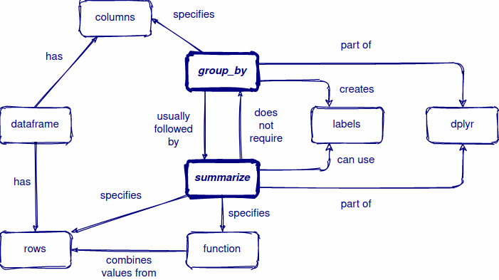

# RStudio certification: Teaching exam

This repository contains the materials I used for the RStudio teaching exam.

## Learner persona

**Peter pivot table**

Peter is an Excel user who often summarises data using pivot tables. He has seen some of his colleagues using R and wants to try it out for himself. He has been able to work through a few online tutorials for getting started with R and the tidyverse, but some things are still not making sense, and he gets frustrated when things don't work out as he expects. Peter needs to build some confidence in his abilities with R and see tangible progress with his learning in order to stay motivated.

## Materials

-   [Slides code](slides/index.html) | [Slides published](https://split-apply-combine-with-dplyr.netlify.app)

-   [Live demo workbook](live_example.Rmd)

-   [Interactive workbook](https://harryfish.shinyapps.io/formative_assessment/)

## Concept map

[Source: [rstudio/concept-maps](https://github.com/rstudio/concept-maps#group_by-and-summarize)]