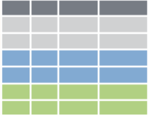
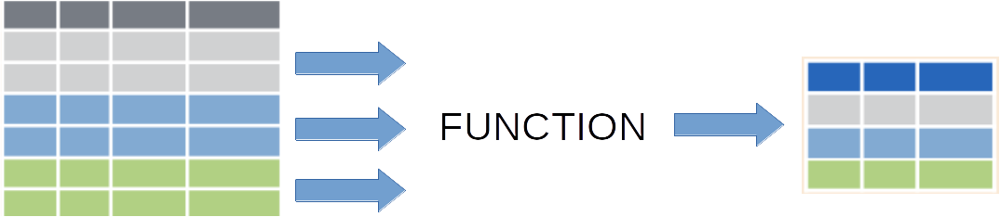

```{r setup, include=FALSE}
knitr::opts_chunk$set(echo = FALSE, message = FALSE)
library(xaringanthemer)
library(flair)
library(dplyr)
style_solarized_light(link_color = "#268bd2")
```

```{r share-again, echo=FALSE}
#xaringanExtra::use_share_again()
xaringanExtra::use_panelset()
xaringanExtra::use_tachyons()
xaringanExtra::use_editable(expires = 1)
xaringanExtra::use_extra_styles(
  hover_code_line = TRUE,         #<<
  mute_unhighlighted_code = TRUE  #<<
)
```

class: center, inverse

background-image: url(img/title_slide.png)
background-position: 50% 40%
background-size: 100%

# Split-apply-combine with `dplyr`

<br><br><br><br><br><br><br><br> <!-- better way to do this?! -->

### Harry Fisher

### [`r icon::fontawesome("twitter")`](https://twitter.com/harryfishr)  [harryfishr](https://twitter.com/harryfishr) | [`r icon::fontawesome("github")`](https://github.com/hfshr) [hfshr](https://github.com/hfshr) | [`r icon::fontawesome("globe")`](https://hfshr.xyz) [https://hfshr.xyz](https://hfshr.xyz)

---

### Learning objectives

--

* **Review:** What is split-apply-combine and why it is useful?

--

<br>

* **Learn:** How to do split-apply-combine using `group_by()` and `summarise()`.

--

<br>

* **Apply:** Use `group_by()` and `summarise()` to effectively summarise data.

---

### Review

--

.bg-washed-green.b--dark-green.ba.bw2.br3.shadow-5.ph4[

.center[**60 second task**]

What do you think of when you hear the phrase "split-apply-combine"?

]

<br>

--

.ba.bw2.br3.shadow-5.ph4[

.can-edit.key-likes[

*

<br>

*

<br><br><br>

]

]

---

### Review

What is split-apply-combine?

--

- **Split** the data into groups based on some criteria.

<br>
<br>
<br>
<br>
<br>

```{r  out.width = "28.3%"}

```

---

### Review

What is split-apply-combine?

- **Split** the data into groups based on some criteria.

- **Apply** a function to each group independently.

<br>
<br>
<br>

```{r out.width="64.4%"}

```

---

### Review

What is split-apply-combine?

- **Split** the data into groups based on some criteria.

- **Apply** a function to each group independently.

- **Combine** the results into a data structure.

<br>

```{r}

```

--

<br>

.bg-washed-green.b--dark-green.ba.bw2.br3.shadow-5.ph4[

.center[**So how do we do this with `dplyr`?**]

]

---

### Concept map

--

```{r}
knitr::include_graphics("img/grouby_summarise.png")
```


.footnote[Source: [rstudio/concept-maps](https://github.com/rstudio/concept-maps#group_by-and-summarize)]

---

### Split-apply-combine with `dplyr`

--

* **Split**: `group_by()`

--

* **Apply & combine**: `summarise()`

--

* We can link these commands together using the "pipe" operator: `%>%`

<br>

--

**All together, this looks like:**

--

.bg-light-gray.b--dark-gray.ba.bw2.br3.shadow-5.ph4[

`data %>%`

`group_by() %>%`

`summarise()`

]

---

### Split-apply-combine with `dplyr`

* **Split**: `group_by()`

* **Apply & combine**: `summarise()`

* We can link these commands together using the "pipe" operator: `%>%`

<br>

**All together, this looks like:**

.bg-light-gray.b--dark-gray.ba.bw2.br3.shadow-5.ph4[

`data %>%`

`group_by(group1, group2, ...) %>%`

`summarise(summary_column1 = summary_function1(...), ...)`
]
--

<br>

.bg-washed-green.b--dark-green.ba.bw2.br3.shadow-5.ph4[

.center[**Let's try with some real data!**]

]
---

```{r echo = TRUE}
library(palmerpenguins)
library(dplyr)

glimpse(penguins)
```

---

### Examples

--

.bg-washed-green.b--dark-green.ba.bw2.br3.shadow-5.ph4[

Our data contain three types of penguins. 

**Goal:** We want to gather some summary statistics about the different types.

]

--

.panelset[

.panel[.panel-name[Example #1]

Count the number of penguins in each species

```{r simple-example, include=FALSE}
penguins %>% 
  group_by(species) %>% 
  summarise(count = n())
```

```{r}
decorate("simple-example", eval = FALSE) %>% 
  flair("group_by", color = "red") %>% 
  flair("summarise", color = "red") %>% 
  flair_funs(color = "purple")
```

]

.panel[.panel-name[Output #1]

```{r ref.label = "simple-example", echo=FALSE, message=FALSE}
```

]

.panel[.panel-name[Example #2]

Also add a column for the mean bill length

```{r simple-example2, echo = FALSE, eval=FALSE}
penguins %>% 
  group_by(species) %>% 
  summarise(count = n(),
            mean_bill_length = mean(bill_length_mm))
```

```{r}
decorate("simple-example2", eval = FALSE) %>% 
  flair("group_by", color = "red") %>% 
  flair("summarise", color = "red") %>% 
  flair_funs(color = "purple")
```

]

.panel[.panel-name[Output #2]

```{r ref.label = "simple-example2", echo=FALSE, message=FALSE}
```

]

]
---

class: center, inverse, middle


## Oh no! `NA`'s!

---

### Example with NA's

--

.bg-washed-green.b--dark-green.ba.bw2.br3.shadow-5.ph4[

.center[**Live example**]

]

---

### Example with NA's

Because our data contains `NA`'s, we have to let R know we want to ignore these values and still calculate the mean for the values we _do_ have.

--

```{r simple-example3, echo = FALSE, eval=FALSE}
penguins %>% 
  group_by(species) %>% 
  summarise(count = n(),
            mean_bill_length = mean(bill_length_mm, 
                                    na.rm = TRUE))
```

```{r}
decorate_chunk("simple-example3", eval = TRUE) %>% 
  flair("group_by", color = "red") %>% 
  flair("summarise", color = "red") %>% 
  flair_funs(color = "purple") %>% 
  flair("na.rm = TRUE", color = "orange")
```

--

.bg-washed-green.b--dark-green.ba.bw2.br3.shadow-5.ph4[

.center[**Much better!**]

]

---

class: center, inverse, middle


# Your turn!

[click here](https://harryfish.shinyapps.io/formative_assessment/) 

---

### Summary

Today, you have:

--

* **Reviewed** the split-apply-combine workflow for summarising data

--

* **Learnt** how to use `group_by` and `summarise`. 

--

* **Applied** your knowledge to some example problems concerning penguins

--

<br><br>

.bg-washed-green.b--dark-green.ba.bw2.br3.shadow-5.ph4[

.center[**Good job!**]

]

---

### Concept map

```{r}
knitr::include_graphics("img/grouby_summarise.png")
```


.footnote[Source: [rstudio/concept-maps](https://github.com/rstudio/concept-maps#group_by-and-summarize)]

---

class: inverse

### More resources

* An [introduction to data manipulation with `dplyr`](https://datacarpentry.org/R-genomics/04-dplyr.html) from the carpentries. 

* Another [split-apply-combind tutorial](https://jofrhwld.github.io/teaching/courses/2017_lsa/lectures/Session_3.nb.html#piping) with `dplyr`.

* [R for data science](https://r4ds.had.co.nz/) book for more on this topic and many other related concepts.  